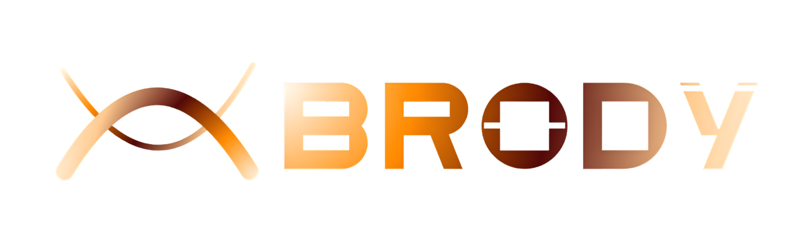

<div align="center">



# Brody — Your Game Dev Homie

**The autonomous, in-editor AI co-developer engineered specifically for Unity.**  
Generates production C# scripts, constructs scenes, orchestrates toolchains, and verifies builds live.

[](https://unity.com/)
[](https://github.com/DecNet-Games/Brody)
[](LICENSE.md)
[](https://brody.decnetgames.com)

</div>

---

> [!IMPORTANT]
> **Tester Release Notice**: This package is an active tester preview for beta developers. Before integrating Brody into active production projects, please ensure your project is backed up or committed to version control (Git, Plastic SCM, or Perforce).

---

## Core Capabilities

Unlike standard LLM code assistants that only emit snippets in a browser tab, **Brody directly controls and orchestrates the Unity Editor**:

- **Autonomous Engine Operations**: Instantiates GameObjects, configures transforms, binds components, and creates prefabs natively.
- **In-Editor Web & Documentation Search**: Retrieves live Unity documentation, API references, and technical solutions right within the editor.
- **Roslyn AST Pre-Compiler Guard**: Validates synthesized C# code against compiler rules and obsolete APIs before saving to disk.
- **High-Speed Streaming Engine**: Real-time server-sent event (SSE) token streaming for responsive pair programming.
- **Deterministic Undo Checkpoints**: Serialized editor state snapshots allow 1-click reversions for any scene or script modifications.

---

## Installation via Unity Package Manager (UPM)

### Option 1: Git URL (Recommended)
1. In the Unity Editor, navigate to **Window** ➔ **Package Manager**.
2. Click the **`+`** icon in the top-left toolbar.
3. Select **Add package from git URL...**
4. Paste the repository URL:
   ```text
   https://github.com/DecNet-Games/Brody.git
   ```
5. Click **Add**. Unity will import and initialize Brody automatically.

### Option 2: Add via `Packages/manifest.json`
Open your project's `Packages/manifest.json` and add to the `dependencies` block:
```json
{
  "dependencies": {
    "com.decnet.brodyai": "https://github.com/DecNet-Games/Brody.git"
  }
}
```

---

## Quickstart

1. **Open the Brody Window**:
   - Menu: **Brody ➔ Open Brody Chat** (or press `Ctrl+Shift+B` / `Cmd+Shift+B`).
2. **Authenticate**:
   - Menu: **Brody ➔ Account & Settings ➔ Cloud Sign In**.
   - Enter your Brody Access Key or sign in via browser.
3. **Prompt & Build**:
   - Enter your requirements (e.g., *"Create a smooth 2D character controller with double-jump, coyote time, and particle effects."*).
   - Brody inspects the codebase, creates the scripts, and configures the scene automatically.

---

## Roadmap

- **Procedural 3D Mesh & Material Synthesis**: In-editor texture and model creation pipelines.
- **Shader Graph & Visual Scripting**: Automated node graph generation.
- **Local Model Support**: Offline LLM execution via Ollama and BYOK.

---

## License & Support

Brody is developed and maintained by **[Decnet Games](https://brody.decnetgames.com)**.  
For documentation, tutorials, and cloud access keys, visit **[brody.decnetgames.com](https://brody.decnetgames.com)**.